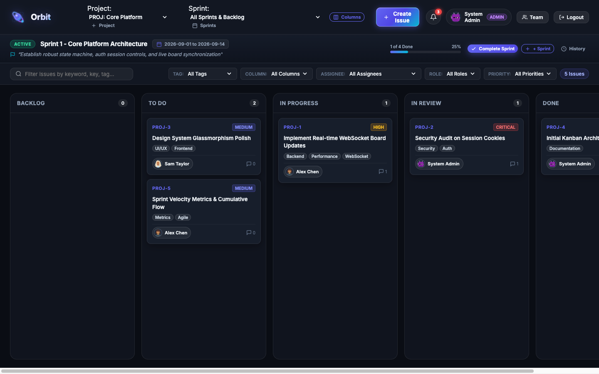
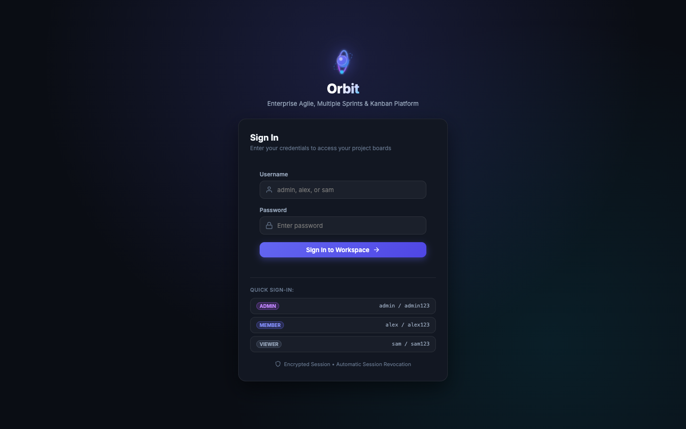
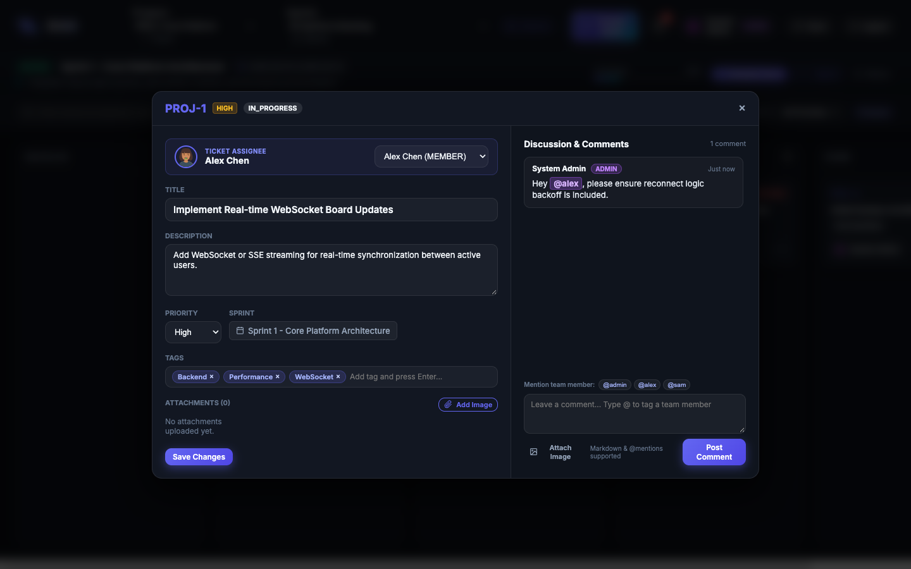
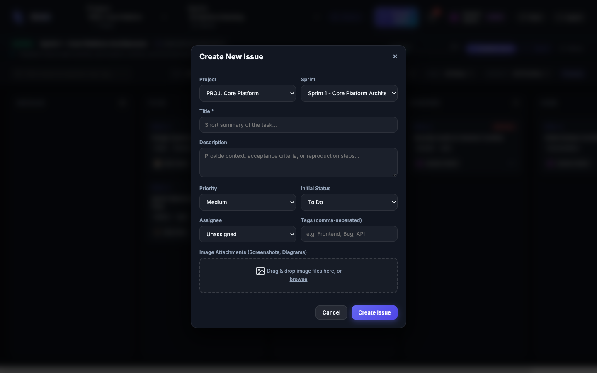

# Orbit: Enterprise Agile Project Management & Kanban Platform

Orbit is a modern, high-performance agile project management system and issue tracker featuring dynamic Kanban boards, multiple sprint backlogs, state machine transition guards, and LexoRank fractional indexing.

The repository is natively integrated with the **AgentGraph** autonomous orchestration harness, pairing isolated Git worktrees with deterministic compiler verification gates and offline Markdown memory consolidation ("dreaming").

---

## 🖥️ User Interface Showcase

### Home Page (Main Dashboard & Sprint Kanban Board)
The central workspace displays project health, active sprint progress metrics, multi-project switching, and dynamic Kanban column lanes.


*Figure 1: Orbit main dashboard featuring active sprint progress tracking, multi-column Kanban lanes, filter controls, and LexoRank card positioning.*

---

### Login Page (User Authentication Screen)
Dedicated authentication view supporting role-based access control (`ADMIN`, `MEMBER`, `VIEWER`), session validation, and immediate invalidation on logout.


*Figure 2: Orbit sign-in screen featuring glassmorphic styling, animated planetary SVG branding, and quick credential switching.*

---

### Ticket View (Individual Issue Details & Discussion)
Deep dive into issue specifications with status tracking, sprint assignment, file attachments, and threaded team discussions with `@mention` notifications.


*Figure 3: Detailed ticket view displaying metadata attributes, file attachment manager, and team discussion thread with inline user tagging.*

---

### Create Issue Screen (Issue Formulation Modal)
Fast issue formulation supporting project and sprint routing, initial status selection, priority ranking, customizable tags, and drag-and-drop asset attachments.


*Figure 4: Create Issue modal providing structured inputs for ticket summary, acceptance criteria, priority, assignees, and attachment uploads.*

---

## 🚀 Key Features

- **Agile Kanban Board**: Visual drag-and-drop column lanes (`Backlog`, `To Do`, `In Progress`, `Code Review`, `Done`) with dynamic custom column support.
- **Sprint Management**: Multi-sprint planning cycles with real-time completion percentages, capacity tracking, and sprint history logs.
- **Issue Tracking & Keys**: Auto-incrementing project issue keys (e.g. `PROJ-1`, `PROJ-2`).
- **Deterministic State Machine**: Strictly validates issue status transitions and automatically manages `resolved_at` timestamps.
- **LexoRank Fractional Indexing**: Instant, collision-free card re-ordering without expensive batch updates.
- **Role-Based Access Control (RBAC)**: Strict role hierarchy (`ADMIN`, `MEMBER`, `VIEWER`) guarding board management, sprint operations, and role assignments.
- **Team Discussions & Mentions**: Markdown comments, image attachments, and instant notification alerts.
- **AgentGraph Harness Embedded**: Native multi-agent DAGs (`workflows/`), persistent markdown memory (`.memory/`), and deterministic exit-code-0 verification gates (`GEMINI.md`).

---

## 🛠️ Tech Stack

- **Backend**: Python 3.9+ with FastAPI, Pydantic, and SQLite/PostgreSQL persistence adapters.
- **Frontend**: Glassmorphic dark-mode web application built with Vanilla HTML/CSS/JavaScript and Google Fonts.
- **Autonomous Engine**: AgentGraph (DAG scheduler, Git worktrees, pristine verifier, dreaming engine).
- **Testing**: Pytest suites with strict binary verification gates.

---

## 📦 Quickstart

```bash
# Setup virtual environment
python3 -m venv .venv
source .venv/bin/activate
pip install -r requirements.txt

# Run test suites
pytest tests/ -v

# Start the application
python -m uvicorn backend.api.app:app --port 8000 --reload
```

Open [http://127.0.0.1:8000](http://127.0.0.1:8000) in your browser to access the Orbit workspace.

---

## 🧠 Semantic Memory & AgentGraph Integration

Orbit maintains version-controlled operational knowledge and architectural invariants inside [.memory/](file:///.memory/):
- [architecture.md](.memory/architecture.md): System invariants, state machine transition rules, RBAC boundaries, and session contracts.
- [conventions.md](.memory/conventions.md): Engineering standards, type hinting requirements, and testing conventions.
- [failure-patterns.md](.memory/failure-patterns.md): Cataloged regression rules and verified edge-case fixes maintained by the Dreaming Engine.
- [decisions/](.memory/decisions/): Architecture Decision Records (ADRs).

Execute offline memory dreaming consolidation:
```bash
python -m src.cli dream --trace-dir .logs/sessions --memory-dir .memory
```

---

## 📄 License

MIT License. See [LICENSE](LICENSE) for details.
